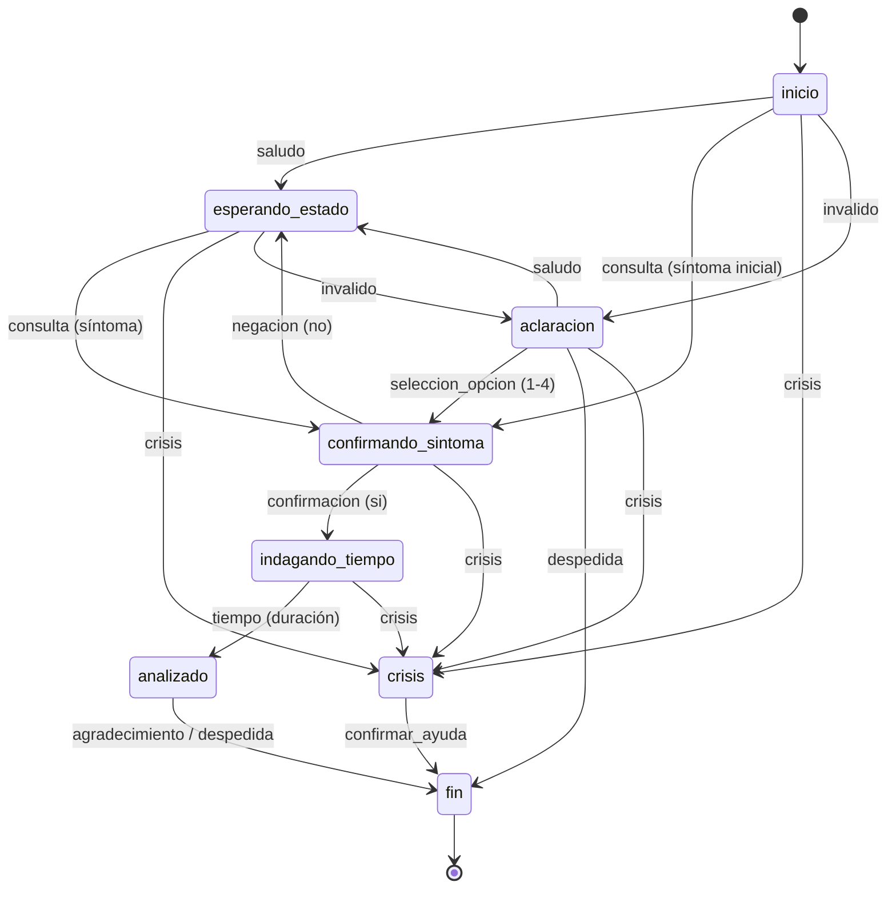

# Sistema de Triaje Psicológico Automatizado

---

## 1. Descripción General

Este sistema es un motor de entrevista clínica y triaje psicológico que procesa descripciones de síntomas en español para inferir su tipo, severidad y cronicidad. Transforma narrativas espontáneas de pacientes en datos estructurados y reportes clínicos mediante herramientas formales de Procesamiento de Lenguaje Natural, construidas desde cero sin dependencias de bibliotecas de PLN de alto nivel o transformers.

El sistema cuenta con un menú interactivo que permite:
* Analizar oraciones libres en español, construyendo y mostrando su árbol de derivación sintáctica.
* Iniciar una entrevista interactiva guiada por un chatbot empático basado en una Red de Transición Aumentada (ATN).
* Ejecutar una suite de auto-verificación con oraciones de prueba.
* Analizar y calcular las probabilidades de desambiguación léxica de palabras en base a un corpus.

---

## 2. Especificación Formal

### 2.1 Autómata Finito Determinista (DFA) — Tokenizador
El tokenizador utiliza un autómata finito determinista para normalizar y segmentar el texto. Se define por la 5-tupla:

$$\mathcal{M} = (Q, \Sigma, \delta, q_0, F)$$

* Q = {0, 1} (donde 0 es q_space y 1 es q_word)
* $\Sigma$ = {a-z, 0-9, áéíóúüñ, espacio, puntuación}
* $q_0$ = 0 (estado inicial)
* F = {0} (estados de aceptación)

Transiciones:
* Desde el estado 0: si el carácter es alfanumérico o vocal acentuada en español, transiciona al estado 1 y empieza a acumular caracteres.
* Desde el estado 1: si el carácter es alfanumérico o vocal acentuada, permanece en el estado 1. Si es un espacio o puntuación, transiciona al estado 0 y guarda la palabra acumulada como un token.
* Si el análisis termina estando en el estado 1, la palabra se guarda como el último token del texto.

### 2.2 Gramática Libre de Contexto (CFG)
Definida formalmente por $\mathcal{G} = (V, T, P, S)$:
* V (No terminales): `{S, NP, VP, AP, SP, Exp_temp, Vinf, Tunidad, Neg, Pro, Clit, Det, Prep, Prep_temp, Num, N, Adj, Adv_int, Adv_frec, Vcop, Vsent, Vcuesta, Vtrans, Vmod, Vintr, V_inf, Vcris}`
* T (Terminales): Vocabulario registrado en el léxico clínico de la gramática.
* P (Producciones): Reglas sintácticas para estructurar el español clínico. Reglas principales:
  * $S \rightarrow NP\ VP \;\mid\; VP \;\mid\; Neg\ VP \;\mid\; NP\ Neg\ VP$
  * $S \rightarrow S\ Conj\ S$ (soporte de conjunción "y")
  * $NP \rightarrow Det\ N \;\mid\; Pro \;\mid\; N \;\mid\; Det\ N\ SP$
  * $VP \rightarrow Vcop\ AP \;\mid\; Clit\ Vsent\ AP \;\mid\; Vtrans\ NP \;\mid\; Vmod\ Vinf \;\mid\; Vmod\ Vcris\ NP$
  * $AP \rightarrow Adj \;\mid\; Adv\_int\ Adj \;\mid\; Adj\ SP$
  * $SP \rightarrow Prep\ NP \;\mid\; Prep\_temp\ Exp\_temp$

### 2.3 Gramática de Cláusulas Definidas (DCG)
La DCG separa las reglas estructurales del léxico y añade rasgos a cada categoría léxica representados en diccionarios (DAGs). 

Rasgos Clínicos Principales:
* `dim` (Dimensión): `animo`, `ansiedad`, `fisico`, `cognitivo`, `crisis`, `neutro`
* `sev` (Severidad): `bajo`, `medio`, `alto`, `critico`, `neutro`
* `pol` (Polaridad): `pos`, `neg`, `neutro`
* `escala` (Escala temporal): `corto`, `medio`, `largo`, `muy_largo`

### 2.4 Unificación
El algoritmo unifica los rasgos (DAGs) de los nodos del árbol durante el análisis sintáctico. 
* Valida la concordancia de género (`gen`), número (`num`) y persona (`pers`), tratando al valor `'neutro'` como un comodín.
* Realiza la combinación de rasgos clínicos aplicando precedencia semántica (priorizando `crisis` sobre otras dimensiones) y escalamiento de severidad cuando existen múltiples síntomas.
* Aplica inversión lógica ante la negación clínica (ej. *"no tengo pensamientos de muerte"* cambia la polaridad a `pos` y disminuye la severidad a `bajo`).

### 2.5 ATN de Diálogo
La máquina de diálogo orquesta la interacción del triaje empleando una memoria de contexto conversacional. Su transición de estados se modela de la siguiente forma:



* **Registros de contexto:** Almacena el histórico de oraciones aceptadas por el parser, la lista de dimensiones detectadas, la severidad máxima encontrada, la cronicidad temporal y un contador de entradas no reconocidas.
* **Confirmación Activa:** Antes de preguntar por la temporalidad, el chatbot entra en el estado `confirmando_sintoma` pidiendo una respuesta explícita de "SI" o "NO" sobre el síntoma y severidad inferida.
* **Aclaración Asistida:** Si el paciente comete 3 fallos de entrada consecutivos, el diálogo pasa a `aclaracion`, mostrando un menú numerado (1-4) con opciones simplificadas de malestar clínico.
* **Protocolo de Crisis:** Si el parser detecta rasgos clínicos de crisis crítica (ej. *"quiero hacerme daño"*), la ATN transiciona inmediatamente a `crisis`, interrumpiendo el flujo normal para proveer información de las líneas de emergencia.

### 2.6 Manejo de Ambigüedad Léxica
Resuelve la ambigüedad categorial de palabras homónimas del vocabulario calculando la categoría más probable mediante la regla bayesiana a partir de frecuencias de un corpus clínico:

$$P(c \mid p) = \frac{\text{Conteo}(p, c)}{\sum_{c'} \text{Conteo}(p, c')}$$

Heurística aplicada a términos ambiguos detectados:
* *siento* $\rightarrow$ Categorías posibles: `Vsent` (v. sentir afectivo, P=0.79) o `Vtrans` (v. transitivo de sensación, P=0.21)
* *bajo* $\rightarrow$ Categorías posibles: `Adj` (adjetivo de nivel, P=0.62), `Prep` (preposición, P=0.21) o `Vintr` (v. bajar, P=0.17)
* *sobre* $\rightarrow$ Categorías posibles: `Prep` (P=0.87) o `N` (P=0.13)
* *como* $\rightarrow$ Categorías posibles: `Conj` (P=0.63) o `Vintr` (P=0.37)
* *un* / *una* $\rightarrow$ Resuelve dinámicamente si funciona como artículo indefinido o como cuantificador numérico (`Num`) en expresiones de tiempo.

---

## 3. Arquitectura del Sistema

Los archivos del proyecto y su distribución bajo el directorio principal de implementación son:

*   [Implementacion/main.py]: Orquestador de consola interactiva con el menú de usuario.
*   [Implementacion/gramatica.py]: Especificación del léxico, DAGs y las producciones CFG/DCG.
*   [Implementacion/corpus_clinico_ambiguo.txt]: Registro de frecuencias para la desambiguación.
*   [Implementacion/test_sustentacion.py]: Suite de pruebas del sistema clínico y diálogo multiturno.
*   [Implementacion/tokenizacion/dfa_tokenizer.py]: Implementación del tokenizador DFA.
*   [Implementacion/sintaxis/arbol.py]: Clases del Nodo de derivación y visualizador gráfico y ASCII.
*   [Implementacion/sintaxis/parser_dcg.py]: Analizador recursivo descendente con backtracking.
*   [Implementacion/sintaxis/unificacion.py]: Algoritmo de unificación de concordancia y combinación semántica.
*   [Implementacion/sintaxis/desambiguador.py]: Calculador bayesiano de desambiguación categorial.
*   [Implementacion/dialogo/atn_dialogo.py]: Red de Transición Aumentada (ATN) conversacional.
*   [Implementacion/util/severidad.py]: Tablas de modulación clínica e intensificación de severidad.

---

## 4. Cómo Ejecutar

El sistema requiere Python 3 instalado.

### Prerrequisitos (Opcional)
Para generar diagramas gráficos de los árboles sintácticos en formato de imagen (`arbol_derivacion.png`), se puede instalar **Matplotlib**:
```bash
pip install matplotlib
```
Si no se encuentra instalado, el sistema continuará su ejecución y mostrará los árboles de derivación en formato ASCII por consola de manera regular.

### Ejecución de la Interfaz Interactiva
Navegue al directorio de implementación e inicie `main.py`:
```bash
cd Implementacion
python main.py
```

### Ejecución de la Suite de Pruebas
Si desea verificar la batería de flujos conversacionales, manejo de crisis, desambiguación y validación de oraciones clínicas, ejecute:
```bash
python test_sustentacion.py
```

---

## 5. Entradas y Salidas

### 5.1 Modo 1 — Analizador de Oraciones Libres
* **Entrada:** `"me siento muy triste desde hace semanas"`
* **Salida por consola:**
  ```text
  Tokenización DFA : ['me', 'siento', 'muy', 'triste', 'desde', 'hace', 'semanas']
  [OK] ORACIÓN ACEPTADA POR LA GRAMÁTICA!

  EXTRACCIÓN SEMÁNTICA CLÍNICA:
    • Dimensión Clínica  : ANIMO
    • Severidad Estimada : MEDIO
    • Polaridad          : NEG
    • Escala Temporal    : MEDIO

  ÁRBOL DE DERIVACIÓN (REPRESENTACIÓN ASCII):
  +-- [S] (dim=animo, sev=medio, pol=neg, escala=medio)
      +-- [VP] (dim=animo, sev=medio, pol=neg, escala=medio)
          +-- [Clit] "me"
          +-- [Vsent] "siento"
          +-- [AP] (dim=animo, sev=medio, pol=neg)
              +-- [Adv_int] "muy"
              +-- [Adj] "triste"
          +-- [SP] (escala=medio)
              +-- [Prep_temp] "desde"
              +-- [Exp_temp] (escala=medio)
                  +-- [Prep_temp] "hace"
                  +-- [Tunidad] "semanas"
  ```

### 5.2 Modo 2 — Entrevista de Triaje Interactiva (Chatbot ATN)
El chatbot genera un reporte conversacional y añade al final la correspondiente estructura clínica entre corchetes.

#### Caso 2.1: Autotriaje Directo Completo
* **Entrada:** `"Siento mucha ansiedad desde hace una semana"`
* **Salida:**
  ```text
  [RESULTADO] === RESULTADO DEL TRIAJE PSICOLOGICO ===
    Dimensiones Clinicas Afectadas: Ansiedad/Tension Emocional
    Cronicidad / Duracion de Sintomas: Subagudo (duracion intermedia, semanas)
    Severidad Estimada: ALTO -- Nivel II (Urgencia)
    Recomendacion Clinica: Se aconseja acudir a valoracion medica prioritaria.
  ===========================================
  Te agradecemos por tu honestidad. ¿Hay algo mas en lo que te pueda colaborar hoy?

  [Categoría: Ansiedad, Intensidad: Alta, Tiempo: 7 días]
  ```

#### Caso 2.2: Reporte de un Tercero
* **Entrada:** `"Mi hermano no duerme bien"`
* **Salida:**
  ```text
  Entendido. He registrado un reporte sobre un tercero (Sujeto: Tercero) que presenta síntomas de insomnio.
  Te sugiero recomendarle buscar apoyo profesional de manera directa.

  [Sujeto: Tercero, Síntoma: Insomnio, Acción: Reporte]
  ```

---

## 6. Casos en los que el Sistema Falla

Debido a su naturaleza formal basada en reglas sintácticas y léxico estrictos, el sistema rechazará las siguientes estructuras:

### 6.1 Oraciones fuera de vocabulario
El sistema solo procesa palabras declaradas en el léxico. Términos no registrados (ej. *"estoy compungido"*) serán rechazados por el parser.

### 6.2 Estructuras gramaticales no contempladas
La gramática admite oraciones simples y coordinadas por la conjunción *"y"*. Las estructuras complejas de subordinación sustantiva o adjetiva (ej. *"siento que la vida no vale la pena"*) causarán rechazo sintáctico.

### 6.3 Oraciones interrogativas o exclamativas
El sistema no contempla reglas para procesar oraciones de tipo interrogativo (ej. *"¿por qué me siento cansado?"*).

### 6.4 Negación compleja
Estructuras de doble negación o modulación compleja (ej. *"no es que no me sienta bien"*) no están contempladas y fallarán en el parser.

### 6.5 Verbos en tiempos no contemplados
El léxico está configurado para verbos en tiempo presente. Tiempos verbales del pasado o futuro (ej. *"estuve muy ansioso ayer"*) serán rechazados al no concordar léxicamente.

### 6.6 Límites del enfoque de desambiguación
Al desambiguar por frecuencias globales del corpus, en contextos sintácticos particulares la categoría seleccionada podría no corresponder con la función local de la palabra (ej. interpretar *"siento"* como verbo transitivo en oraciones donde es puramente copulativo).

---